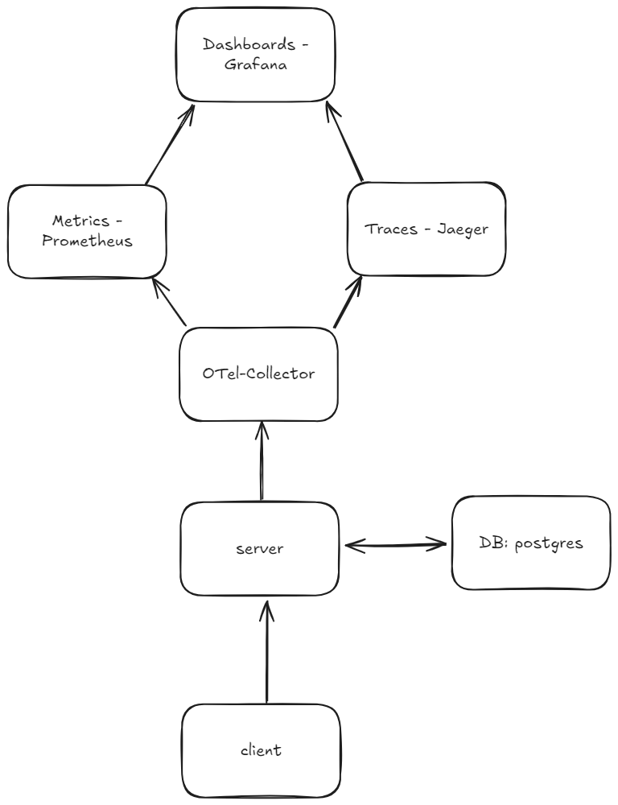

## CRUD Project with gRPC, PostgreSQL, and OpenTelemetry

This project is a CRUD service using gRPC, PostgreSQL, and monitoring tools such as OpenTelemetry, Jaeger, and Prometheus. 

<p align="center">

</p>

## Getting Started

### 1. Clone the repository
```sh
git clone https://github.com/lahaehae/golang-grpc-crud
cd crud_project
```
### 2. Start with Docker

```sh
docker compose up --build
```
If server does not start, you need to start it manually from Docker Desktop.

#### Monitoring
- Grafana: http://localhost:3000
- Jaeger (for tracing): http://localhost:16686
- Prometheus (for metrics): http://localhost:9090

#### API methods
The service provides the following gRPC methods:
- CreateUser – Create a new user.
- GetUser – Retrieve user details by ID.
- UpdateUser – Update user information.
- DeleteUser – Remove a user by ID.

```proto
service UserService {
  rpc CreateUser (CreateUserRequest) returns (CreateUserResponse);
  rpc GetUser (GetUserRequest) returns (GetUserResponse);
  rpc UpdateUser (UpdateUserRequest) returns (UpdateUserResponse);
  rpc DeleteUser (DeleteUserRequest) returns (DeleteUserResponse);
}
```


#### gRPC_UI
You need to run script which is written in Makefile, using:
```sh
make build_grpc_ui
```
Then you can interact with methods.


